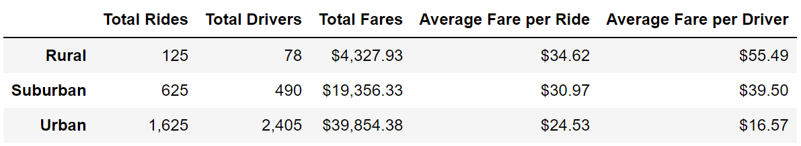
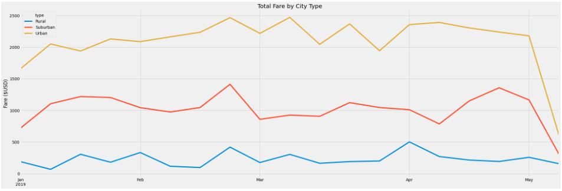

# PyBer_Analysis

## Overview of the Analysis

### Purpose

This analysis includes a summary DataFrame of the ride-sharing data by city type and a multiple-line graph that shows the total weekly fares for each city type to summarize how the data differs by city type and how those differences can be used by decision-makers at PyBer.

## Results

### Differences in Ride-Sharing Data Among the Different City Types

The largest volume of rides was recorded in Urban cities and the smallest volume was recorded in Rural cities. In Urban cities there were more drivers than rides, but the data showed more rides than drivers in Rural and Suburban cities. Average fares were lower in Urban cities than Rural both by ride and by driver, however, Urban cities saw the highest total fare volume, more than doubling the Suburban volume. 

## Summary

### Business Recommendations

#### Disparities Among the City Types

1. There are many more drivers than are needed for the ride volume in urban cities as opposed to suburban and rural cities that have not reached the same levels of saturation. Desicion makers may benefit from shifting the volume of drivers outwards toward suburban and rural areas.
2. Decrease fares in urban areas to encourage a larger volume of rides in urban cities which is proven to have enough drivers to support the increase in rides due to cheaper fares.
3. The time series of total fare by city type is relatively flat across the months of Jan-May, it is reccomended that no seasonal action is taken.
