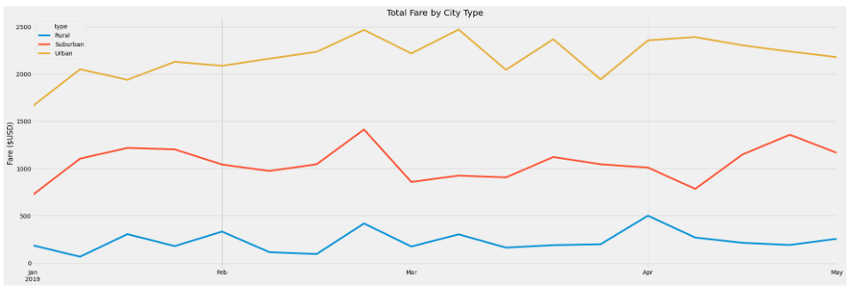

# PyBer_Analysis

## Overview of the Analysis

### Purpose

This analysis includes a summary DataFrame of the ride-sharing data by city type and a multiple-line graph that shows the total weekly fares for each city type to summarize how the data differs by city type and how those differences can be used by decision-makers at PyBer.

## Results

### Differences in Ride-Sharing Data Among the Different City Types

The largest volume of rides was recorded in Urban cities and the smallest volume was recorded in Rural cities. In Urban cities there were more drivers than rides, but the data showed more rides than drivers in Rural and Suburban cities. Average fares were lower in Urban cities than Rural both by ride and by driver, however, Urban cities saw the highest total fare volume, more than doubling the Suburban volume. 

## Summary

### Business Recommendations

#### Disparities Among the City Types

1. Recommendation
2. Recommendation
3. Recommendation
